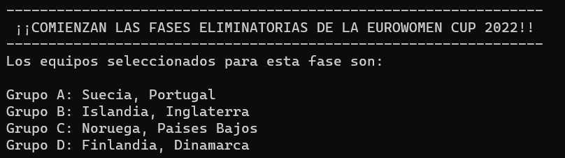
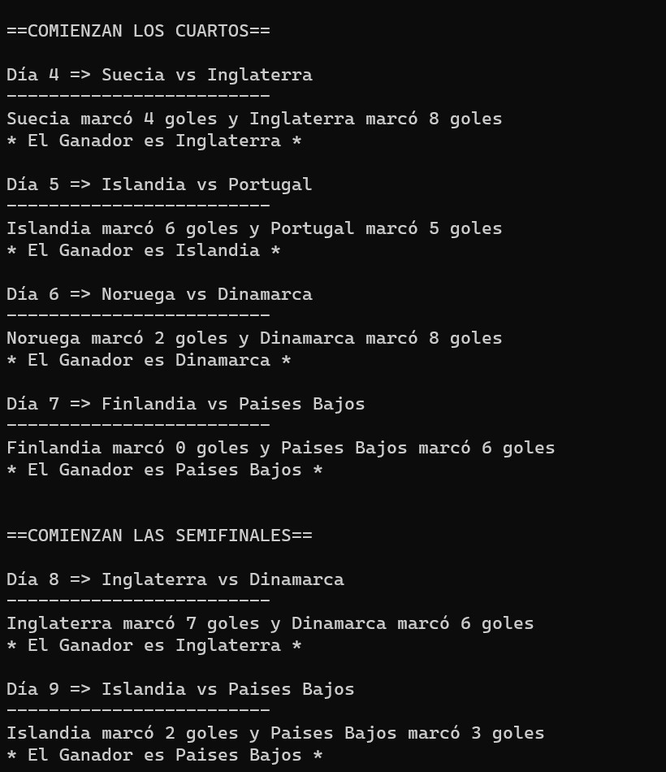
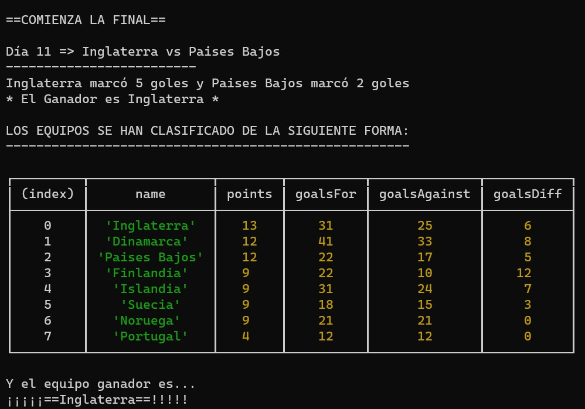
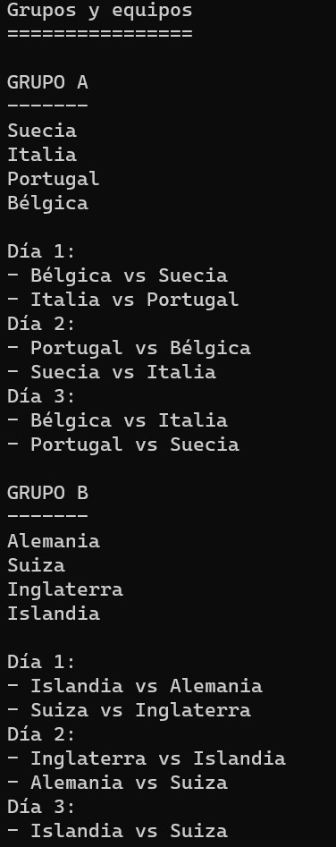
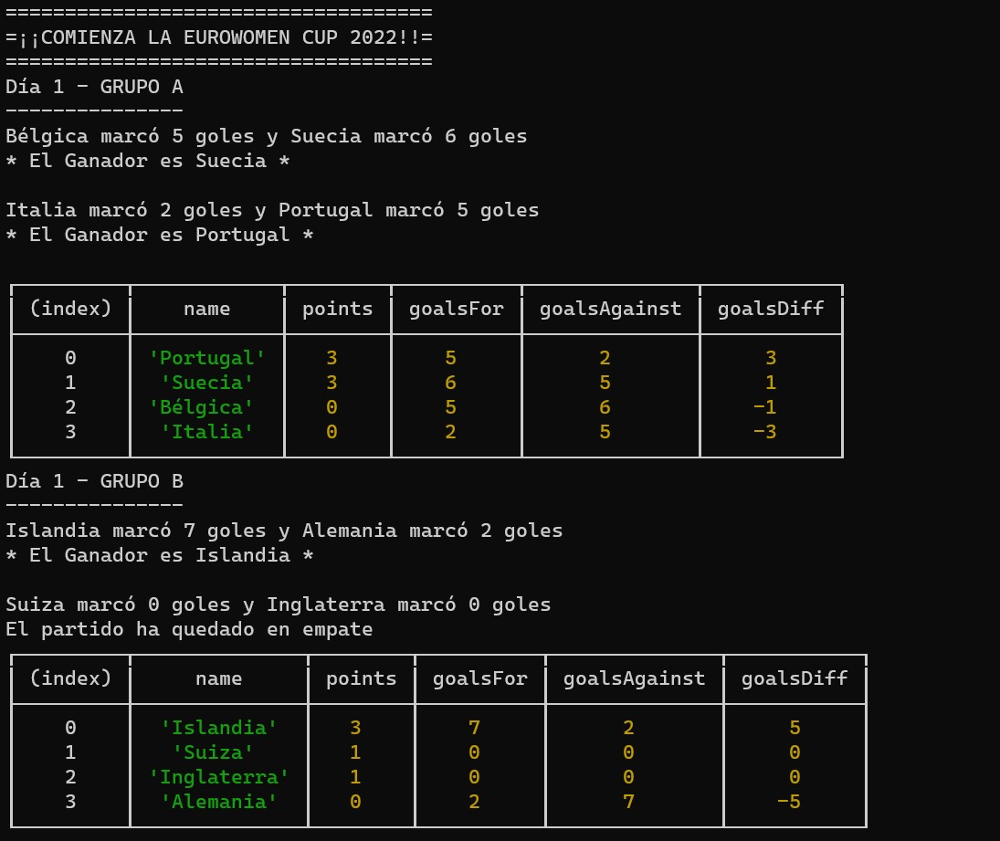

# SIMULADOR EUROWOMENS CUP 2022 #

Este proyecto trataba de hacer una simulación de una liga de fútbol. Desde las fases eliminatorias hasta la final.

Es un proyecto encargado en clase para el bootcamp **Desarollador Web Full Stack** de la escuela *Keepcoding*.

Es del módulo correspondiente a **Introducción a Javascript**.

## ORGANIZACION DEL REPOSITORIO ##

La organización del repositorio es simple.

El archivo *index.js* ejecuta la simulación completa, desde las fases eliminatorias hasta la final, mostrando al ganador de la Liga.

El archivo *fasedegrupos.js* ejecuta únicamente las fases eliminatorias de la Liga (vamos, la fase de grupos).

El archivo *teams.js* contiene la creación de la clase "Teams" y la creación de los equipos.

El archivo *package.json* está añadido para que funcionen correctamente las exportaciones e importaciones de archivos .js con node.

El archivo *launch.json* está añadido para poder utilizar el elemento *debug* de la aplicación visual studio code (que es con la que he trabajado).

La carpeta *functions* contiene los diferentes archivos de funciones que he creado para que la simulación funcione correctamente.

La carpeta *imagenes de muestra* contiene las imágenes que podrán visualizar en este mismo archivo *readme*.

## DESARROLLO DE LA SIMULACIÓN ##

Para este proyecto me he decantado por crear funciones de forma separada y exportarlas luego para poder utilizarlas porque me he sentido más cómoda en este caso trabajando de esta forma, a pesar de que en clase trabajamos un proyecto similar funcionando con *clases*.

También he querido introducir las *clases*. Me ha parecido que era la forma más eficiente de crear los equipos (ya que se componían de nombre, grupo y estadísticas que teníamos que ir actualizando como número de goles, partidos, etc.), pero es cierto que me he decantado mucho más por el uso de funciones exportadas aparte.

### REQUISITOS ###

El proyecto se componía de 2 partes:

- **Play-Offs:**

Esta era la parte obligatoria.

Trataba de jugar los cuartos, semifinal y final (y opcionalmente el tercer y cuarto puesto) de la Liga. 

Debía comenzar con un mensaje que indicase el comienzo de los partidos y mostrando los equipos seleccionados para jugar:

Después comenzaban los partidos (también se debía mostrar el mensaje de cada fase). Se debía indicar que 2 equipos se enfrentaban, el número de goles marcado por cada uno de ellos y finalmente, cual era el ganador.

El reparto de equipos para los partidos, se hacían de forma que no se enfrentasen hasta la final equipos que ya se hubiesen enfrentado previamente.

No podía haber empate.

Por último, se mostraría el ganador. 

Yo he querido añadir también una tabla con la clasificación final y en la tabla no aparecen todas las propiedades de los objetos, la he filtrado para que aparezcan solo las que nos interesaban.

- **Fase de grupos**

Esta parte era opcional, pero si se hacía también debía cumplir ciertos requisitos.

Debía comenzar indicando los equipos que jugarían esta fase. Estos equipos se agrupaban en 4 grupos (A, B, C y D) y se seleccionaban para cada grupo de forma aleatoria. De modo que cada vez que se ejecuta el programa, los equipos cambian de grupo.

Después se indica la planificación de los partidos que se van a jugar. Esta planificación se genera basándonos en un algoritmo de todos contra todos en el que cada equipo juega un partido al día y todos se llegan a enfrentar contra todos al finalizar la fase.

Una vez presentados, comenzaríamos con los partidos. 

Nuevamente, comienza con el mensaje correspondiente y luego se muestran los partidos jugados por jornada y grupo (con la misma dinámica que la anteriormente descrita). 

En este caso se añade la distribución de unos puntos en función de como ha terminado el partido (3 para el equipo ganador, 1 si hay empate para los 2 equipos y 0 para el equipo perdedor).

He querido añadir también unas estadísticas (nº de partidos jugados, ganados y perdidos, etc) que estuvimos trabajando en clase.

También se solicitaba que se ordenasen los equipos cada jornada por puntuación, en caso de empate, por diferencia de goles y en caso de empate también, por orden alfabético. 

Después se debía mostrar esta clasificación.

Finalmente, se seleccionarán los 2 primeros equipos de cada grupo para jugar la fase final  o PlayOff (la fase anteriormente descrita).

